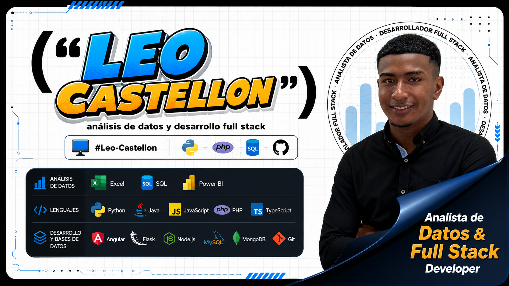

# Hola, Mi nombre es Leonel Castellon👋

#### DATA ANALYST JUNIOR - FULLSTACK DEVELOPER

  

Ingeniero de Sistemas, actualmente cursando una especialización en análisis de datos, con conocimientos en análisis y procesamiento de información, bases de datos y desarrollo de aplicaciones web. Cuento con experiencia académica en el manejo de Excel, SQL y Power BI para la extracción, limpieza, transformación, análisis y visualización de datos, así como en tecnologías de desarrollo como Python, JavaScript y PHP, y herramientas de control de versiones como Git. Me caracterizo por mi capacidad analítica, organización y atención al detalle, con interés en el análisis de datos, desarrollo Full Stack y optimización de procesos mediante soluciones tecnológicas.

## Desarrollo

- Python
- Java
- JavaScript
- Php
- Git

## Analisis de Datos

- SQL 
- PowerBI
- Excel
- PySpark
- Azure DataBricks
- Machine Learning

## Contacto

LinkedIn: www.linkedin.com/in/leonel-castellon-yanez-9b3706408

Correo: cl485443@gmail.com

